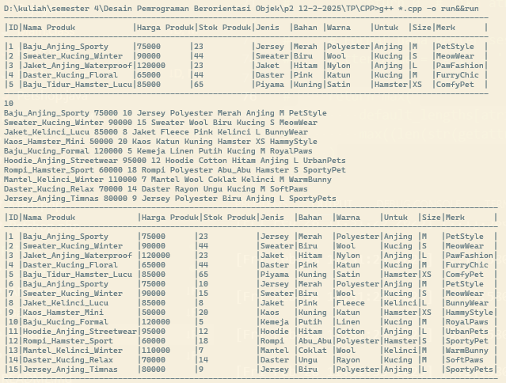
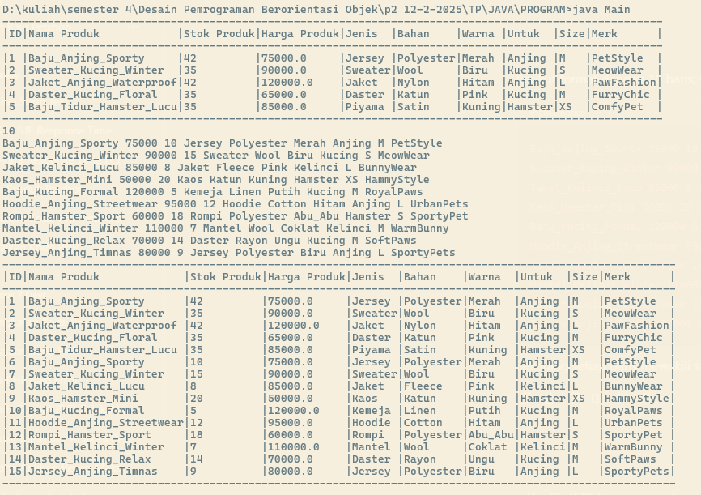
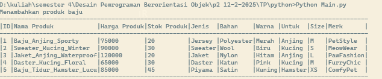
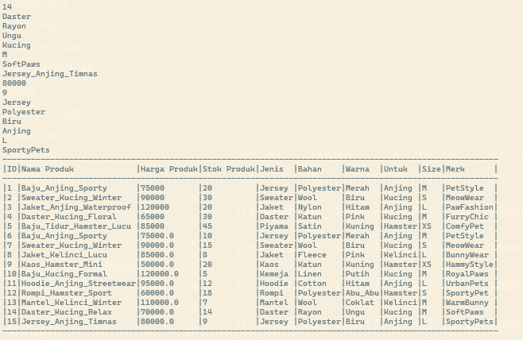
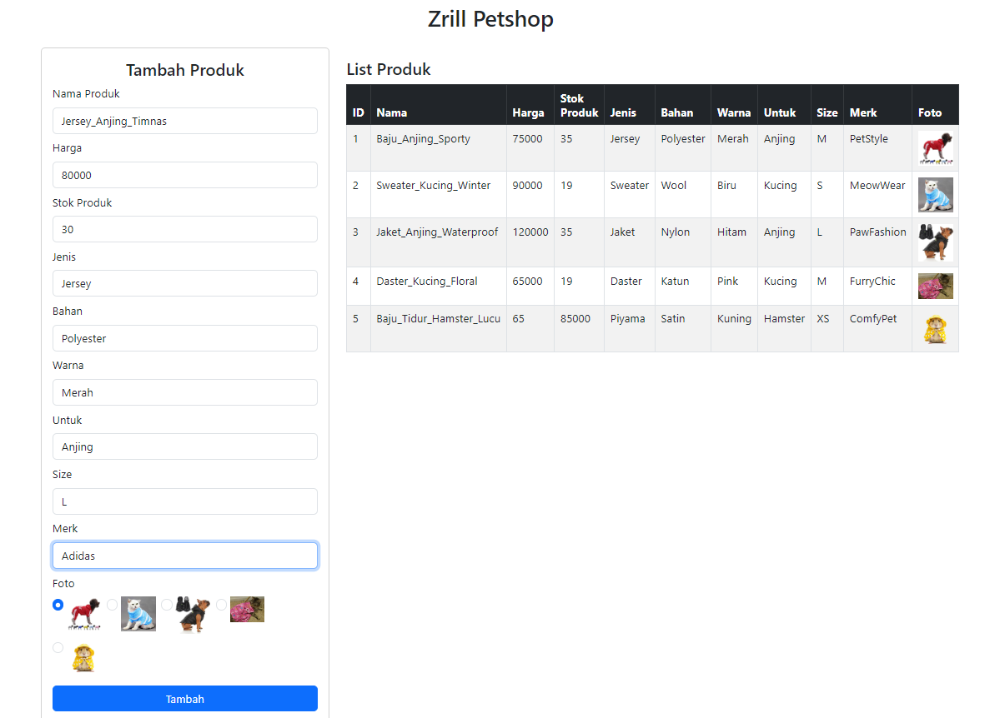
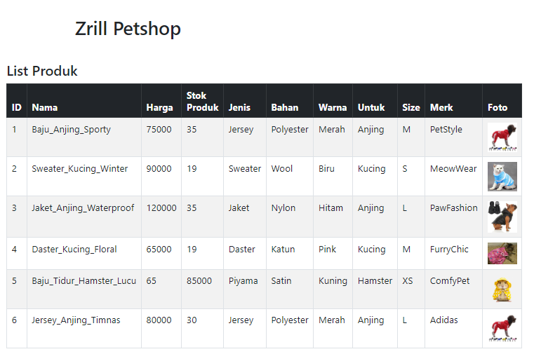

# Tugas Praktikum 2 DPBO 2025 C1
## Ilmu Komputer Universitas Pendidikan Indonesia

### **Janji**
Saya, **Raffi Adzril Alfaiz** dengan **NIM 2308355**, mengerjakan Tugas Praktikum 2 dalam mata kuliah **Desain dan Pemrograman Berorientasi Objek** untuk keberkahan-Nya. Maka saya tidak melakukan kecurangan seperti yang telah dispesifikasikan. **Aamiin.**

---

## **Dokumentasi**

### **1. C++**  

---

### **2. Java**  

  

---

### **3. Python**  

---

### **4. PHP**  

---

## **Alur Program**

### **1. Pendefinisian Kelas Petshop (Parent Class)**
Kelas **Petshop** merupakan kelas dasar (parent class) yang memiliki atribut:
- `id (int)` → ID produk
- `nama_produk (string)` → Nama produk
- `harga_produk (float)` → Harga produk
- `stok_produk (int)` → Stok produk
- `foto_produk` → Foto produk (PHP)

#### **Fitur:**
- Konstruktor default menginisialisasi atribut dengan nilai awal.
- Konstruktor parameter menerima nilai untuk setiap atribut.
- Getter dan Setter tersedia untuk mengakses serta mengubah nilai atribut.
- Destructor (`~Petshop()`) akan dipanggil ketika objek dihapus.

---

### **2. Pendefinisian Kelas Aksesoris (Turunan dari Petshop)**
Kelas **Aksesoris** merupakan turunan dari kelas **Petshop** dan menambahkan atribut baru:
- `jenis (string)` → Jenis aksesoris
- `warna (string)` → Warna aksesoris
- `bahan (string)` → Bahan aksesoris

#### **Fitur:**
- Konstruktor default dan parameter.
- Getter dan Setter untuk atribut tambahan.
- Destructor (`~Aksesoris()`) akan dipanggil saat objek dihapus.

---

### **3. Pendefinisian Kelas Baju (Turunan dari Aksesoris)**
Kelas **Baju** merupakan turunan dari **Aksesoris** dan menambahkan atribut:
- `untuk (string)` → Baju untuk hewan apa (misal: anjing, kucing)
- `size (string)` → Ukuran baju
- `merk (string)` → Merk baju

#### **Fitur:**
- Konstruktor default dan parameter.
- Method `addBaju` untuk menambahkan informasi ke objek **Baju**.
- Getter dan Setter untuk atribut tambahan.
- Destructor (`~Baju()`) akan dipanggil saat objek dihapus.

---

### **4. Fungsi untuk Menghitung Panjang Atribut (`get_length_atribut_baju`)**
Fungsi ini menerima nama atribut dan list objek **Baju**, lalu menentukan panjang maksimum dari nilai atribut tersebut agar tabel yang ditampilkan rapi.

#### **Proses:**
- Iterasi pada setiap elemen list.
- Membandingkan panjang karakter maksimum untuk menentukan lebar kolom yang optimal.

---

### **5. Fungsi untuk Menampilkan Tabel Data Baju (`tabel_baju`)**
Fungsi ini menerima list objek **Baju** dan menampilkan tabel dengan format rapi secara **DINAMIS**

#### **Proses:**
- Menggunakan `get_length_atribut_baju()` untuk menentukan lebar kolom.
- Mencetak header tabel dengan format rata.
- Iterasi data dari setiap objek dan menampilkannya dengan format tabel.

---

### **Alur Eksekusi Program**
1. Membuat list untuk menyimpan objek **Baju**.
2. Menambahkan objek ke dalam list menggunakan konstruktor atau method `addBaju()`.
3. Menampilkan tabel yang berisi informasi semua baju menggunakan fungsi `tabel_baju()`.